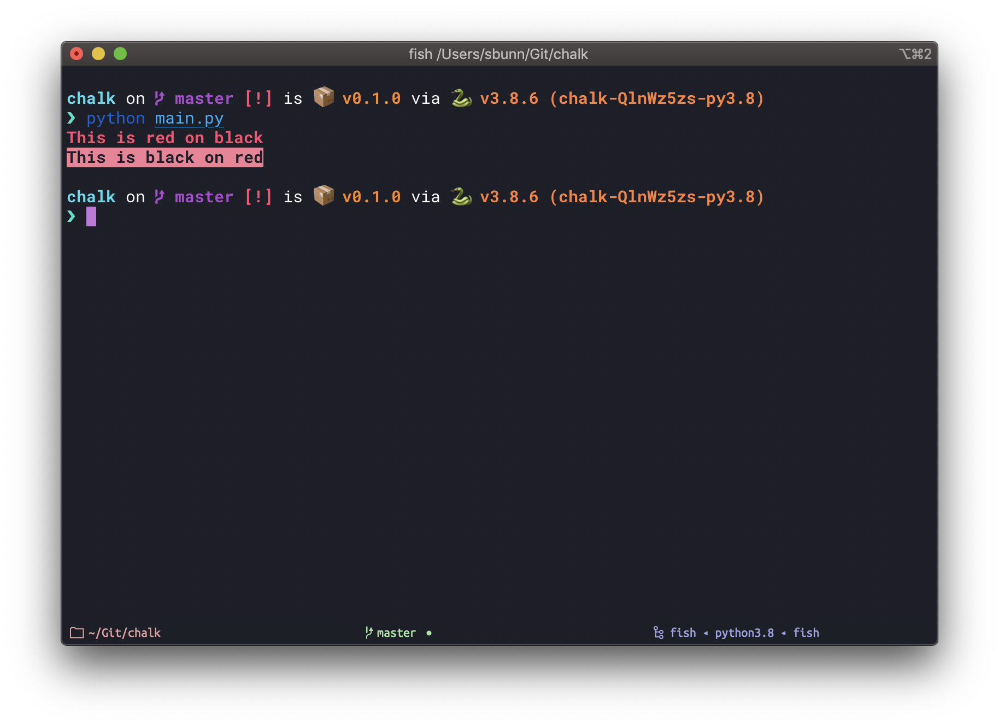
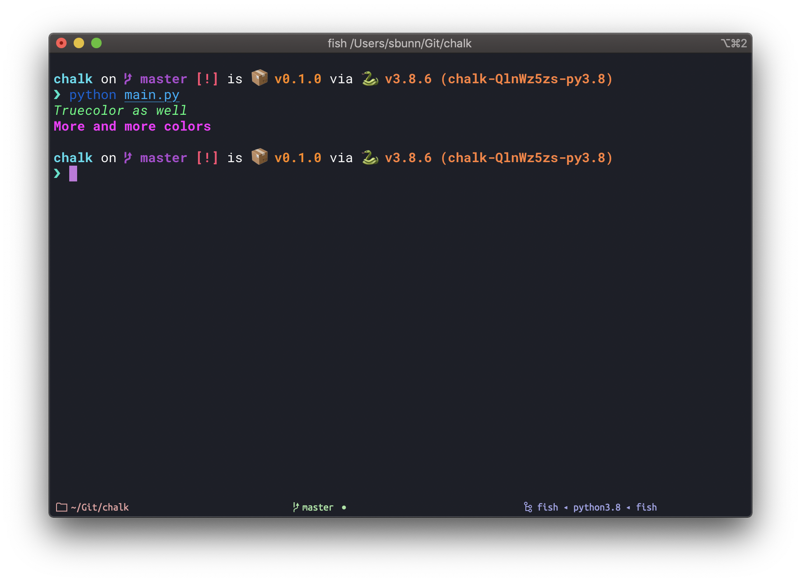

# Chalky

[](https://pypi.org/project/chalky/)
[](https://github.com/stephen-bunn/chalky)
[](https://chalky.readthedocs.io/)
[](https://github.com/ambv/black)

> Simple ANSI terminal text coloring

```python
from chalky import sty, fg

my_style = sty.bold & fg.red
print(my_style | "This is red on black")
print(my_style.reverse | "This is black on red")
```



```python
from chalky import rgb, sty, hex

print(rgb(23, 255, 122) & sty.italic | "Truecolor as well")
print(sty.bold & hex("#ff02ff") | "More and more colors")
```


